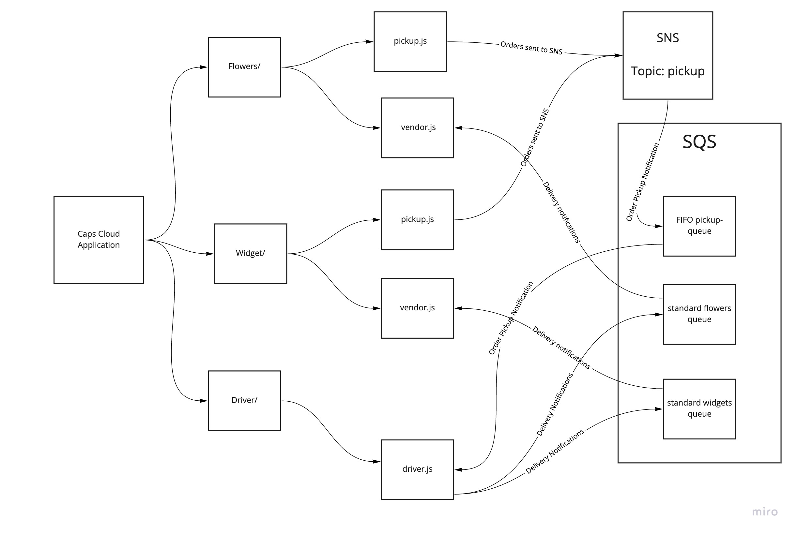

# caps-cloud

## Github PR
https://github.com/gerstej9/caps-cloud/pulls?q=is%3Apr+is%3Aclosed

## Usage
To use, run either or both of the pickup.js in flowers and widgets folders respectively. These will send notifications to the SNS pickup on AWS SNS. In turn these messages will be sent to the packages FIFO queue on AWS SQS. When driver.js in the driver folder is run it will receive the messages in that AWS FIFO queue and will then send notifications of delivery to the standard queue hosted in AWS SQS for the vendor whose package it was. The vendor.js in either vendors folder, when ran, will pull the notifications of delivery from their respective delivery SQS queues

## UML

## Class notes
* Learn how to use AWS SNS
* Learn how to use AWS SQS
* Learn how to convert socket.io application to cloud based application